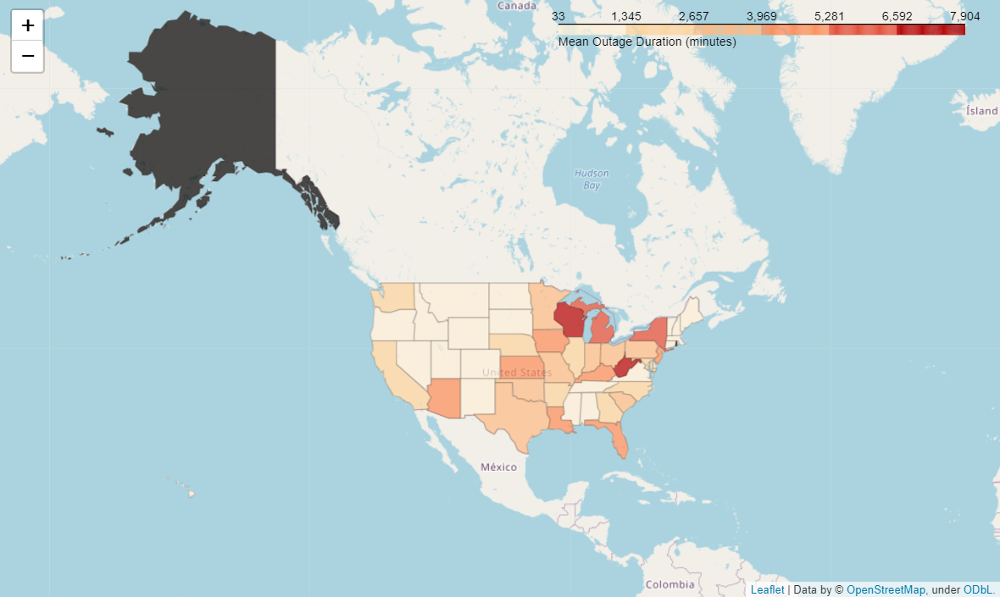
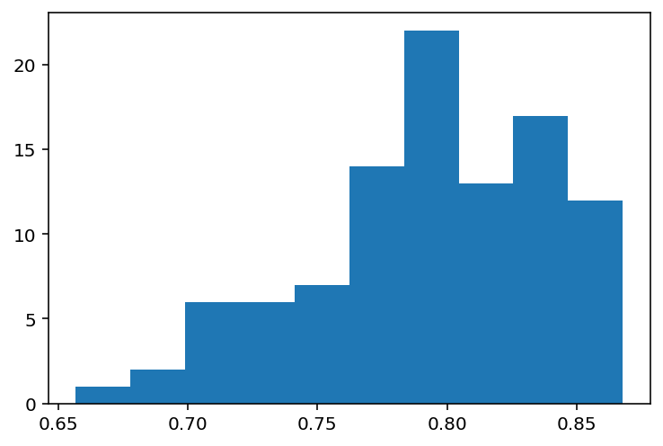

# Power Outages
Final project for DSC80 at UCSD, with inferential data analysis and basic regression. This project made use of a geospatial dataset on power outages in the US from 2000-2015, including information on the outage itself (its cause, duration, coverage, etc.), and the outage's location (its populational, industrial, economic, climatological data, etc.)
# Data Analysis including EDA and predictive modelling on power outages dataset.
* outage.xlsx: 1000+ row dataset of the list of outages in the US from 2000 to 2016
* outage_EDA: notebook with data-cleaning and EDA (Exploratory Data Analysis) and hypothesis testing on the dataset
* outages: notebook with data-cleaning and predictive modelling on the dataset
#### Folium_pictures from outage_EDA:

# Predictive Modelling:
* For the project's predictive model, linear regression was used to predict what percentage of customers for a state would be affected by a power outage.
* Sklearn pipelines were used to transform the data and improve the model, including log-scaling features, removing redundant features, finding optimal parameters.
* After these transformations, the linear regression's distribution of prediction scores improved to be around 80%

